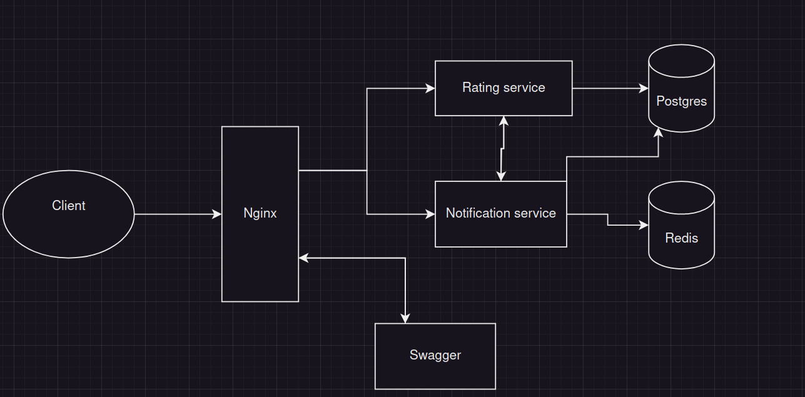

# prontoPro

## Prerequisites && quick start

Docker engine, docker-compose and bash. Free ports on 80, 8080, 7000, 7001, 6379, 5432 

If you are on linux then you can run script **start.sh**. 
Or you you can run docker compose on ./deployments/docker-compose.yaml

Navigate to [localhost:80/swagger/]() to see open api documentation

## Preface

I was struggling with this project. Not because requirements are hard but mostly 
that I am finding myself trying to write it as Java developer. And you can see it 
in the project why it took me so much time:

- Wrong wrappers and some confusion around interfaces. Golang uses composed classes while java
uses interface classes.
- Basically non-existent DI containerization.
- Switching from spring to gin was a painful change. Cloud native libraries for spring cloud allows direct integration, there however it's hardcoded
- Testing problems with mocking, which also puts some part on point 1
- Golang isn't truly OOP language and I was also struggling with encapsulation
- Modules and packages are hard to understand coming from Java structure.

Thus, I truly regret choosing Go instead of C# :)

## Let's talk about the project

### Architecture of the project

This is primary architecture of the cluster. 

- Nginx is serving as entrance point and rate limiter
- Rating and Notification services are business servers
- Swagger for providing whole cluster documentation. From client all requests will be sent to the nginx reverse proxy
- Postgres and Redis as persistent storages

### Codebase
 
- I was trying to follow following [Golang standards](https://github.com/golang-standards/project-layout)
- Monorepo for reusing pkg package and not thinking about connectivity between servers
- Written in Go, just for the sake of it
- Testing isn't quite a match of what you expect. Instead of unit testing I wrote one scenario test.
Reasons: business logic is stored in service files and not that big. Scenario testing checks whole line of user and provider reuqests, thus giving more robustness on build stage. (in fact I am just lazy and I didn't undertand how to properly mock)

### Maintainability, Reliability, Scalability

- Due to not having service discovery mechanism, two interactions between servers are hard code with urls.
Of course docker-compose dns helps but I don't think it has internal load balancing
- It's not really reliable as it was written by me. I would say code by itself unreadable and dirty. Availability can be an issue as well as docker-compose doesn't have self healing
- It's eventually consistent tho. But only because it uses only one instance of each database
- It's scalable. Services follow CQRS pattern so we can setup as many replicas as we need

## Check list
✅ - done

🆗 - meh

❌ - not done 

- Use .NET and/or Go to implement the services. ✅
- The two services must use a communication mechanism such as HTTP ✅
- Include build scripts, Dockerfile, and docker-compose.yml to build and run the
  application. ✅
- Document main decisions about the maintainability, reliability, and scalability
  of the solution. 🆗
- A reasonable number of unit tests are required. 🆗
- Implement exception handling for possible errors in the system. 🆗
- (Optional) Include OpenAPI (previously known as the Swagger) for rating
  service, which outlines the available endpoints and their functionality. ✅
- (Optional) Implement a rate-limiting mechanism to prevent users from 
  submitting too many ratings or overloading the system with requests. ✅
- (Optional) There is no actual need for a notification service to send
  notifications. However, for simulation purposes, these notifications can be
  logged somewhere for debugging and testing. ✅
- (Optional) Implement a structured logging solution of your choice.❌
- (Optional) Integration, or benchmark tests. Using Testcontainers is a plus.❌
- (Optional) A continuous integration pipeline definition (e.g., .travis.yaml,
  Jenkinsfile, .github/workflow ...) ✅